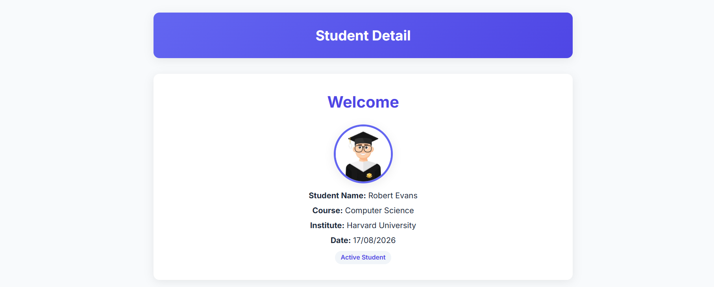
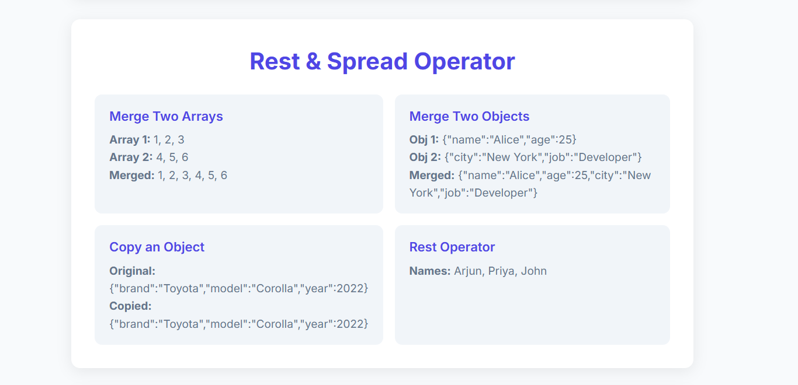
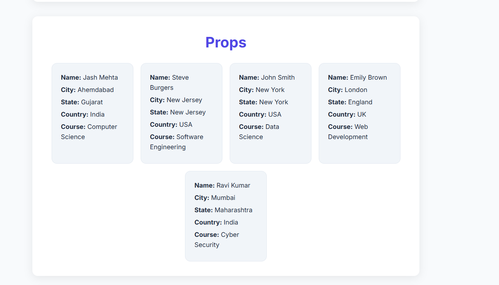
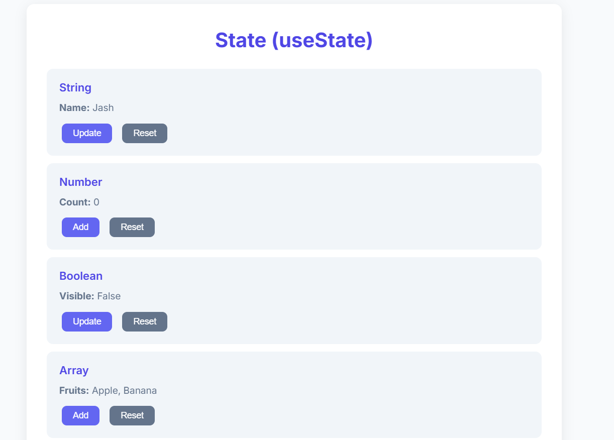
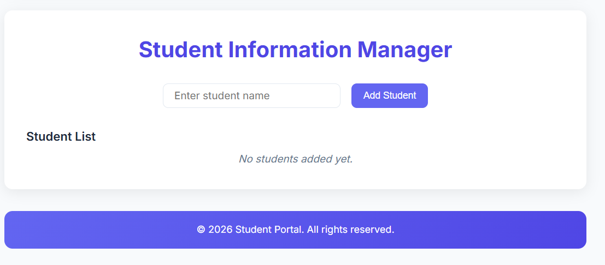

# Scratching React

A Vite + React app built to practice core React concepts. Covers JSX, components, props, state, hooks, and local storage — all displayed on a single page.

## Screenshots

Home page with Header and Welcome section:



Rest & Spread Operator examples:



Student Cards using Props:



useState examples with String, Number, Boolean, Array and Object:



Student Information Manager with Local Storage:



## Demo Video

[▶ Watch Demo Video](./screenshots/demo.mp4)

## How to run

```bash
cd Scratching-react
npm install
npm run dev
```

Then open `http://localhost:5173` in your browser.

## What's inside

- `Header.jsx` — top header bar
- `Footer.jsx` — bottom footer
- `Welcome.jsx` — student info, image, and current date (Task 2)
- `Operators.jsx` — Rest & Spread operator examples (Task 3)
- `StudentCard.jsx` — reusable card component with Props (Task 4)
- `StateExamples.jsx` — useState with 5 data types (Task 5)
- `StudentManager.jsx` — add/delete students with useEffect + localStorage (Task 6)

## Topics Covered

- JSX & Rendering Elements
- Functional Components
- Nested Elements & Attributes
- Rest & Spread Operators
- Props
- useState
- useEffect
- Local Storage
